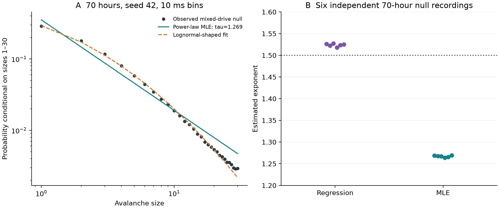

# Null avalanche controls

An ongoing methods study with reproducible preliminary results on how bin width,
shared activity fluctuations and analysis choices affect neuronal avalanche
statistics.

**Current finding:** bin width strongly changes measured branching estimates and
fitted size exponents in the simulated systems. Whether the full bin-width
relationship can distinguish shared drive from propagation remains an open
research question. No experimental neural recordings have been analyzed here.

## Findings so far

The completed [feasibility audit](feasibility/REPORT.md) includes 280 short
synthetic recordings across seven models and six additional 70-hour mixed-drive
recordings, with independent seeds, distribution-fitting checks and timing
surrogates.

- **Binning changes the measured signature.** In the six long mixed-drive runs,
  moving from the repository's rounded inter-event-interval (IEI) rule to 10 ms
  changes mean sigma from 0.607 to 0.985 and the regression exponent from 2.022
  to 1.524.
- **Estimator choice changes the interpretation.** At 10 ms, the mean
  maximum-likelihood exponent is 1.267, rather than the regression value 1.524.
  The exact finite-support power law is rejected in all six long runs. Beating
  an exponential in a relative comparison does not establish an adequate power
  law. These checks do not exclude every form of approximate scaling.
- **Shared drive produces dependence without electrode-to-electrode
  propagation.** The bursty nulls contain correlations and refractory history;
  they are not unstructured or temporally independent data.
- **The tested timing controls do not identify propagation.** Shuffling changes
  shared-drive statistics too, and interval-jitter rejection can reflect burst
  boundaries or refractory structure under the tested nulls.

These findings establish a bin-width relationship in the tested models. They do
not establish that biological activity is or is not critical. The report gives
fit definitions, uncertainty, calibration results and model limitations.



## Research question and next study

**How much of the bin-width dependence can be predicted from event rate, shared
fluctuations, refractoriness and observation alone, and when does adding
propagation improve predictions on held-out data?**

The [prospective research plan](feasibility/RESEARCH_PLAN.md) proposes an analytic
baseline, matched simulations with and without propagation, and subsequent
validation on held-out neural recordings. The target is the whole bin-width
curve and its underlying distributions; matching sigma = 1 and tau = 1.5 is not
the success criterion. These proposed experiments have not yet been run.

Binning effects and shared-drive explanations already have substantial precedent.
The [literature audit](feasibility/LITERATURE.md) identifies the closest work and
why an additional contribution needs to demonstrate useful prediction or
quantify where mechanisms cannot be distinguished. Publication viability for
this refined question remains to be established.

## Start here

| Resource | Contents |
| --- | --- |
| [Feasibility report](feasibility/REPORT.md) | Completed experiments, findings and limitations of the original paper pitch |
| [Reproduction guide](feasibility/README.md) | Installation, pinned environment, run stages and verification |
| [Completed-study protocol](feasibility/PROTOCOL.md) | Experiment grid and statistical checks |
| [Research plan](feasibility/RESEARCH_PLAN.md) | Refined question and proposed next experiments |
| [Literature audit](feasibility/LITERATURE.md) | Primary sources and paper-to-code discrepancies |
| [Results](feasibility/results/) | CSVs, figures, source manifests and validation logs |

The recorded environment uses Python 3.12.14 on Windows. Follow the reproduction
guide for the full study; Linux/macOS instructions are provided but untested.
Large raw event arrays are regenerated from seeds rather than stored in Git.

## Original experiments

The original numerical scripts remain available as the audit baseline:

| Scripts | Purpose |
| --- | --- |
| `simulate.py`, `analyze.py` | Apply a local similarity criterion to IID grid values and group the resulting links into events. This is a separate exploratory experiment. |
| `bp_simulate.py`, `bp_analyze.py` | Generate event trains and sweep bin widths using selected Beggs-Plenz-style avalanche statistics. |
| `bp_compare.py` | Compare the original bin sweeps. |
| `bp_validate.py` | Run the original 50 implementation checks. |
| `feasibility/` | Add multi-seed experiments, statistical checks, propagation-control sensitivities and the written audit. |

Example commands for the original event-train workflow, after installing the
pinned dependencies in the reproduction guide:

```bash
python bp_simulate.py --mode bursty --burst-intensity-sigma 1.0 --hours 3 --out data/bp_bursty_het.npz
python bp_analyze.py --events data/bp_bursty_het.npz --plot-dir plots/bp_bursty_het/
python bp_validate.py
```

The detector groups consecutive occupied time bins bracketed by empty bins.
Count-based size sums events, including repeated activations. The repository's
IEI rule conditions on gaps up to a fixed 200 ms cutoff. The legacy `critical`
generator prevents electrode reuse for an entire cascade; that label is not
validation of its dynamical state. See the literature audit for these and other
observation-model differences from the experimental paper.

## Historical claims

The [original README](https://github.com/Yawsom/null-avalanche-controls/blob/e3b00e4b65441da751de17f35b84f2044be41d15/README.md)
is preserved in Git history as the initial interpretation, not the current
conclusion. It claimed exact reproduction of a critical signature, a faithful
experimental replication and a universal binning guarantee for sigma. The audit
does not support those claims as stated. In particular, the independent-Poisson
identity for the single-ancestor estimator does not extend to arbitrary neural
dynamics or force unity under the conditional IEI rule.

The completed report's recommendation against the original manuscript pitch
applies to that specific claim. It does not imply that bin-width dependence is
absent or that the refined research question is not worth investigating.

## License

[Apache License 2.0](LICENSE).
