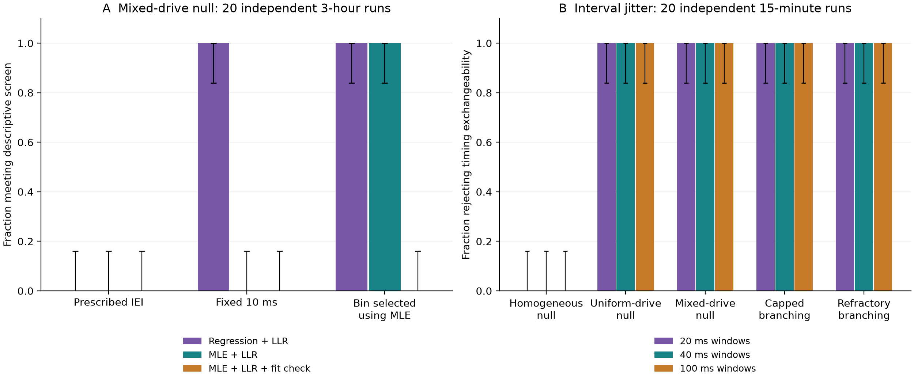

# Publication feasibility decision — 5 September 2026

**Recommendation: do not start the proposed research manuscript on the present
evidence. Preserve this as a reproducible methods audit or technical note.**
The simulations reproduce the repository's headline numbers, but the evidence
does not support a robust 3/2 power law in the mixed-drive null. The proposed
surrogate improvement does not distinguish shared drive from propagation in
these tests. Closely related primary literature already covers the main
mechanism and the surrogate interpretation problem. This is a no-go for this
specific paper pitch, not evidence that research on the broader question is
not worthwhile or that cortex is, or is not, critical.

This was a completed bounded computational study, not a week-long biological
investigation or an exhaustive novelty review. The [protocol](PROTOCOL.md)
records the choices made after the initial exploratory seed-42 finding and
before the multi-seed experiments. Original simulation/analysis scripts were
retained. The audit adds its own statistical helpers, a positive-control
sensitivity model, tests, and reproducible outputs.

**What was run.** The main grid contains 280 synthetic recordings: seven models,
20 seeds (100–119), and two durations (15 minutes and 3 hours). Six additional
mixed-drive recordings lasted 70 simulated hours (seed 42, previously inspected,
plus five new seeds). Together these represent 875 simulated hours across 286
recordings. There are 4,939 bin-sweep rows, 300 distribution-calibration samples,
41,580 interval-jitter surrogate draws, and 560 simpler jitter/full-shuffle
surrogates. Reusing a seed's recording for several analyses does not add an
independent replicate. No experimental neural data were used.

The new finite-array models attempt Poisson offspring with means 0.8, 1.0 and
1.2, include collisions, and allow electrode reuse after an actual 20 ms recovery
window. They are propagation controls, not three proven dynamical phases. Their
nominal parameter is not a measured distance to criticality.

**1. The headline is reproducible, but its interpretation does not survive.**

Mean results over six independent 70-hour mixed-drive recordings, fitting
integer sizes 1–30:

| Analysis bin | Sigma | Regression exponent | MLE exponent | Exact power-law fit rejected |
| --- | ---: | ---: | ---: | ---: |
| Repository IEI rule, rounded | 0.607 | 2.022 | 1.608 | 6/6 |
| Fixed 10 ms, highlighted in original README | 0.985 | 1.524 | 1.267 | 6/6 |

At seed 42 and 10 ms, the original numbers are recovered: sigma=0.986263,
regression tau=1.526085, MLE tau=1.268716, and power-law-versus-exponential
z=34.500373. The exponent in the headline and the power law tested by the
likelihood comparison are different fits. A better fit than an exponential
does not establish an adequate power law, much less the exponent 3/2.

All four fitted supports reject the exact power law in all six long runs.
For the same 10 ms data, mean MLE exponents are 1.163 on 1–15, 1.267 on 1–30,
1.311 on 1–59, and 1.615 on 3–30. A lognormal-shaped discrete family has lower
AIC on each of those comparisons. This is evidence of curvature and support
sensitivity, not proof that a lognormal model is the data-generating law.

The bootstrap has 199 replicates and a minimum reported p-value of 0.005;
values at that floor must not be reported as zero. Under the 70-hour seed-42
10-second block bootstrap, the 95% percentile interval for MLE tau is
[1.264, 1.272], and the centered block KS diagnostic also reports 0.005.
At 3 hours, both 1-second and 10-second block checks on seed 100 give the same
qualitative finding. Dependence adjustment therefore does not explain away the
large exponent discrepancy in the checked recordings.

These are finite-support fits. They do not exclude approximate scaling on every
possible interval or identify an asymptotic tail. The block calculation assumes
dependence is short relative to its block width and is an approximate sensitivity
check, not a guarantee under arbitrary nonstationarity.

Evidence: [long-run fits](results/long_fits.csv),
[time-block resampling](results/block_bootstrap.csv).

**2. Bin selection and estimator choice materially change the result.**

The following table uses 20 independent 3-hour mixed-drive recordings. A
descriptive signature means |sigma−1|<0.2 and |tau−1.5|<0.2, plus the legacy
z>2 comparison against an exponential. These tolerances reproduce the repo's
screen; they are not a validated criticality criterion.

| Bin policy | Regression screen | MLE screen | MLE screen plus KS p>0.05 |
| --- | ---: | ---: | ---: |
| Prescribed, rounded IEI | 0/20 | 0/20 | 0/20 |
| Fixed 10 ms | 20/20 | 0/20 | 0/20 |
| Bin selected to approach (1,1.5) using MLE | 20/20 | 20/20 | 0/20 |

Thus changing to MLE alone is insufficient: selecting a different bin can put
the estimate inside the broad tolerance again. The absolute-fit diagnostic is
what excludes these selected cases. Selecting and evaluating on the same record
is exploratory; we did not treat these results as independent confirmatory
tests. At 15 minutes, the fixed-10-ms regression screen passes 13/20 mixed nulls,
illustrating finite-recording effects in the relative likelihood screen.

Removing integer rounding or using IEI cutoffs of 100 and 400 ms does not rescue
the prescribed-rule result in the 3-hour mixed nulls. Their mean sigmas are
0.641, 0.607 and 0.678 respectively, below the screen's 0.8 boundary.

Zero successes in 20 runs does not prove a zero population rate: a 95% Wilson
interval is approximately 0–16.1%; for 20/20 it is 83.9–100%. These intervals
describe simulation-seed variation under the specified model, not variation
between biological preparations.

Evidence: [per-run fits](results/fits.csv),
[decision summary with intervals](results/decision_summary.csv),
[IEI sensitivity](results/iei_sensitivity.csv).

**3. The candidate timing diagnostic failed the specificity requirement.**

Full shuffling makes the mixed-drive null and the propagating control both look
less power-law-like. At a fixed 10 ms bin in the 15-minute recordings, mean
power-law-versus-exponential z changes from +2.25 to −15.28 for the mixed null,
and from +8.94 to −18.16 for capped branching. Loss of structure establishes
that timing mattered, but does not identify its source. Small jitter can even
increase the mixed-null sigma: its mean changes from 0.986 to 1.024 at ±4 ms.

The additional candidate statistic was adjacent-bin population activity at
4 ms, tested against 99 interval-jitter surrogates per recording. Each surrogate
preserves every electrode's event count within fixed windows. At **each** of
20, 40 and 100 ms window widths, the rejection counts were:

| Generator | Rejections / 20 independent 15-minute recordings |
| --- | ---: |
| Homogeneous null | 0/20 |
| Uniform shared-drive null | 20/20 |
| Mixed shared-drive null | 20/20 |
| Capped propagating control | 20/20 |
| Each of the three refractory propagation controls | 20/20 |

These are false positives only if rejection is interpreted as evidence for
propagation. The timing-exchangeability null itself need not hold for abrupt
burst boundaries or refractory event trains. The result therefore does not
invalidate interval jitter as a conditional test. It does invalidate this
candidate's use as a propagation discriminator on the tested models.

In panel A, "LLR" denotes the legacy normalized likelihood-ratio z>2 screen.
The added fit check uses p>0.05. Panel B reports timing-test rejections, not a
test specifically of propagation. Error bars in both panels are 95% Wilson
intervals over the 20 independent recordings.

Evidence: [paired surrogate metrics](results/surrogate_metrics.csv),
[interval tests](results/interval_tests.csv),
[rejection intervals](results/interval_summary.csv).

**4. Stronger fitting is useful, but is not a universal criticality detector.**

The original capped model is recovered at its known 4 ms generation clock:
over the 20 three-hour runs, mean sigma is 1.004 and MLE tau is 1.468.
However, 26.9% of its detected cascades last more than 20 ms. Prohibiting reuse
for their entire lifetime is a substantive modeling choice.

With the new recovery-window model, mean realized offspring counts per parent
are about 0.727, 0.851 and 0.928 for attempted means 0.8, 1.0 and 1.2. No run
hits the generation safety limit. The nominal-0.8 model passes the weak MLE
signature screen at the IEI bin in 20/20 three-hour runs despite clearly
subcritical attempted reproduction. The nominal-1.0 model can pass the MLE
signature after bin selection, but all its three-hour exact-power-law tests
at that selection reject. Passing an exponent screen does not identify a
dynamical state; failing a pure-power-law fit does not establish absence of
propagation.

The shared IEI rule also misses the known-clock capped positive control, whose
own conditional IEI generally rounds to 1 ms. Thus the mixed null's failure at
that rule does not establish the rule's general sensitivity or optimality.

Calibration used independent multinomial samples, refitted on the same support
in every parametric bootstrap. The exact power-law model was rejected in 2/50
samples of size 1,000 and 1/50 of size 10,000. Exponential samples were rejected
in 50/50 at each size. Samples from the conditional critical Borel progeny law
were rejected in 3/50 and 5/50 respectively. A branching law can have a 3/2
asymptotic tail while differing from an exact power law at small sizes; these
tests assess the specified finite-support law, not the underlying mechanism.

Evidence: [generator diagnostics](results/generators.csv),
[calibration samples](results/calibration.csv),
[calibration summary](results/calibration_summary.csv).

**5. The novelty gate did not pass.**

[Priesemann & Shriki (2018)](https://journals.plos.org/ploscompbiol/article?id=10.1371/journal.pcbi.1006081)
already cover the closest mechanism, its shuffled comparison, and limitations
of observational discrimination.
[Morrell et al. (2024)](https://elifesciences.org/articles/89337) examine richer
latent-drive scaling signatures.
[Amarasingham et al. (2012)](https://pubmed.ncbi.nlm.nih.gov/22031767/) already
explain the conditional meaning and temporal-scale assumptions of interval
jitter. The present results are consistent with these established issues.

The empirical critique would also have to address
[Klaus, Yu & Plenz (2011)](https://journals.plos.org/plosone/article?id=10.1371/journal.pone.0019779),
which reanalyzes original culture data with stronger statistical comparisons.
This audit has not reproduced or contradicted that empirical result.
See the [source-by-source literature and replication audit](LITERATURE.md).

The useful outcome here is a concrete, reproducible demonstration of why this
repository's original headline overreaches. The tested changes do not yet offer
a distinct, validated methodological advance. I would release a carefully
framed technical note with these artifacts, rather than invest in a manuscript
claiming to overturn Beggs–Plenz or to solve propagation inference.

Reopen the research-paper decision only around a new, specific question: for
example, a validated control that retains sensitivity to propagation while
handling measured shared-drive and refractory structure, or a reproducible
finding on accessible neural recordings that changes the conclusion of a
current workflow. Neither outcome has been established here, and this is not
a recommendation to keep expanding the simulation grid indefinitely.

**Limits and reproducibility.** Rates are approximately, not exactly, matched;
the mixed drive loses events to refractoriness. The drive family has abrupt
edges, and new branching models use a fixed 4 ms generation clock and silence
between cascades. There is no LFP measurement model, spatial sampling study,
biological intervention, or complete modern criticality benchmark. All model
comparisons on dependent avalanches are interpreted descriptively, with
independent runs and selected block sensitivities providing replication checks.
The literature search is focused, not exhaustive. These limits bound the
decision to the current artifact and paper proposal.

All 50 original checks and eight new test methods passed. The latter include an
independent likelihood optimizer comparison, a dense oracle for the lag
statistic, actual refractory-window invariants, and bootstrap bookkeeping.
Validation logs, manifests with source hashes, a pinned environment, CSVs, and
PNG/SVG figures are included. [Reproduction instructions](README.md) rebuild
the outputs. No publication, remote upload, or manuscript submission was made.
